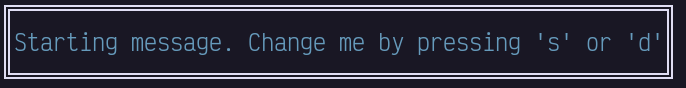
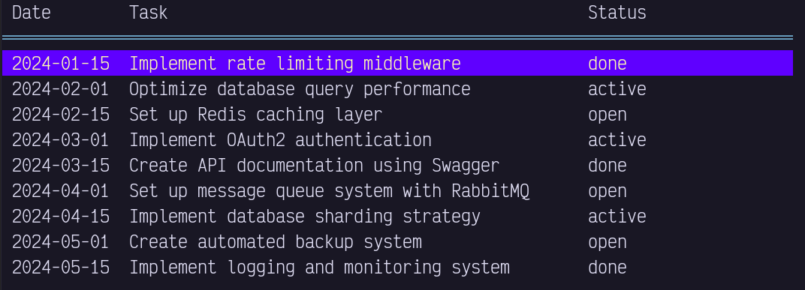
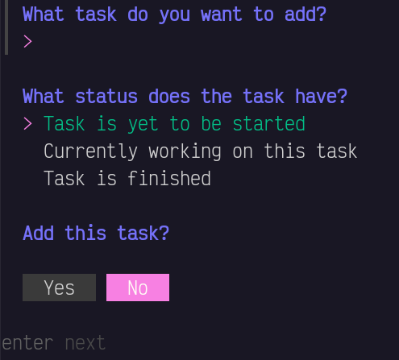

+++
title = "BubbleTea multi model tutorial"
description = "One approach on how to achieve a multi model BubbleTea application"
date = 2024-11-23
tags = ["Go", "BubbleTea","CLI", "multi model", "BubbleTea V1"]

name = "Maximilian Soeren Pollak"
+++


# Outline 

1. Explain the issue 
2. Explain (in short words) the solution
3. Make a walk through example with the proposed solution
4. Link to the source code

#### The issue
[BubbleTea](https://github.com/charmbracelet/bubbletea) is a great library to make gorgeous TUI's in Go. It is my favourite library to create TUI's by far. However, one hurdle that I have encountered, is on working with multimple models. I looke around the internet and did not find solutions that I could understand.   
So in this blog post I would like to make a short example as a guide and help for others who struggel with that concept in BubbleTea.  
*Note: This is by no means the only way to solve this issue, I just found it the easiest to understand for me.*

#### The solution (TLDR)
- It basically boils down to have a 'main model' that switches the active model based on commands and then distributes the messages and commands to the active model.
- Any model if necessary can send a singal to the main model to switch to a different model. 
- The main model then just initalizes the newly 'requested' model.

#### Let's get to work
I will guide you through making a Todo App (I know, I know) that uses multiple models.  
The multimodel part however should be applicable to any project that you might work on. I hope this is simple enough to understand but complext enough so that you see that this solution can work in bigger applications.


#### Humble beginings
Create a new go project with whatever name you fancy and grab BubbleTea which you can do via: `go get github.com/charmbracelet/bubbletea`.  
If you want to style it a tiny bit like I did, you also need [lipgloss](https://github.com/charmbracelet/lipgloss).   
Get it via: `go get github.com/charmbracelet/lipgloss`.

Let's start with our main.go file. Since we will keep this app rather simple we won't need a complex folder structure, but the solution will work for any project structure. 

<details>
    <summary> show the main.go file </summary>

```go 
//main.go
package main

import (
	"fmt"
	"os"

	tea "github.com/charmbracelet/bubbletea"
	"github.com/charmbracelet/lipgloss"
)

type mainModel struct {
	message string
}

func initMainModel() mainModel {
	return mainModel{
		message: "Starting message. Change me by pressing 's' or 'd'",
	}
}

func (m mainModel) View() string {
    // This is not necessary but I wanted to make it at least a bit nicer.
	newStyle := lipgloss.NewStyle().Border(lipgloss.DoubleBorder(), true).Foreground(lipgloss.Color("#669bbc"))
	return newStyle.Render(m.message)
}

func (m mainModel) Init() tea.Cmd {
	return nil
}

func (m mainModel) Update(msg tea.Msg) (tea.Model, tea.Cmd) {
	switch msg := msg.(type) {

	case tea.KeyMsg:
		switch msg.String() {

		case "ctrl+c", "q":
			return m, tea.Quit

		// With these keys we switch the displayed message
		case "s":
			m.message = "This is the other message"
		case "d":
			m.message = "Another switch of the message by a keypress"
		}
	}
	return m, nil
}

func main() {
	p := tea.NewProgram(initMainModel())
	if _, err := p.Run(); err != nil {
		fmt.Printf("Alas, there's been an error: %v", err)
		os.Exit(1)
	}
}
```
</details>
<br>

This will give us a very simple BubbleTea app that we now can execute.
If you run it via `go run main.go` hopefully you should see something like this: 


and you should now be able press `s` or `d` to change the message displayed.

##### The "database"
As we just have an example project, I elected to just use a JSON file for as a "database".
You can just make a new JSON file called `tasks.json` and copy the contents below.

<details> <summary>Show json "database" file</summary>

```json
[
    {
        "date": "2024-01-15",
        "task": "Implement rate limiting middleware",
        "status": "done"
    },
    {
        "date": "2024-02-01",
        "task": "Optimize database query performance",
        "status": "active"
    },
    {
        "date": "2024-02-15",
        "task": "Set up Redis caching layer",
        "status": "open"
    },
    {
        "date": "2024-03-01",
        "task": "Implement OAuth2 authentication",
        "status": "active"
    },
    {
        "date": "2024-03-15",
        "task": "Create API documentation using Swagger",
        "status": "done"
    },
    {
        "date": "2024-04-01",
        "task": "Set up message queue system with RabbitMQ",
        "status": "open"
    },
    {
        "date": "2024-04-15",
        "task": "Implement database sharding strategy",
        "status": "active"
    },
    {
        "date": "2024-05-01",
        "task": "Create automated backup system",
        "status": "open"
    },
    {
        "date": "2024-05-15",
        "task": "Implement logging and monitoring system",
        "status": "done"
    }
]
```
</details>
<br>

Now that we have our "database" we need a way to interact with it. I opted for a simple file that will allows us to read/write as well as define the struct needed.

<details> <summary>show the `tasks.go` file contents</summary>

```go
//tasks.go
package main

import (
	"encoding/json"
	"fmt"
	"os"
)

type Task struct {
	Date   string `json:"date,omitempty"`
	Task   string `json:"task,omitempty"`
	Status string `json:"status,omitempty"`
}

func ReadTaskDBFile(filepath string) []Task {
	data, err := os.ReadFile(filepath)
	if err != nil {
		fmt.Println("Error reading file:", err)
		os.Exit(1)
	}
	var tasks []Task
	err = json.Unmarshal(data, &tasks)
	if err != nil {
		fmt.Println("Error parsing json: ", err)
		os.Exit(1)
	}
	return tasks
}

func SaveTaskDBFile(filepath string, tasks []Task) {
	data, err := json.MarshalIndent(tasks, "", "    ")
	if err != nil {
		fmt.Println("Error marshaling tasks:", err)
		os.Exit(1)
	}
	err = os.WriteFile(filepath, data, 0644)
	if err != nil {
		fmt.Println("Error writing file", err)
		os.Exit(1)
	}
}
```
</details>
<br>

### First active model
Since the `mainModel` in the end will just facilitate the messages and switch between the 'active models' we should start work on one of them.  

If we want to display our newly aquired tasks, of course we can't simply do that in the main model, that would defeat the pourpose.  
So let's create our second model, containing a table that can show us all of our tasks. I will put it into `list.go`  
For that we need the **bubbles** library from charm as well. You can get it via: `go get github.com/charmbracelet/bubbles`

<details> <summary> Show `list.go` file contents </summary>

```go
// list.go

package main

import (
	"fmt"
	"os"

	"github.com/charmbracelet/bubbles/table"
	tea "github.com/charmbracelet/bubbletea"
	"github.com/charmbracelet/lipgloss"
)

type listModel struct {
	table table.Model
}

func initListModel() listModel {
	return listModel{
        // Here we use the function we defined inside our task.go
		table: generateTableFromJSON(),
	}
}

func generateTableFromJSON() table.Model {
    // Here we use the function we defined inside our task.go
	tasks, err := ReadTaskDBFile("tasks.json")
	if err != nil {
		fmt.Printf("could not read all tasks form DB file. Error: %s\n", err.Error())
		os.Exit(1)
	}
	columns := []table.Column{
		{Title: "Date", Width: 10},
		{Title: "Task", Width: 45},
		{Title: "Status", Width: 20},
	}
	var rows []table.Row
	for _, task := range tasks {
		r := table.Row{task.Date, task.Task, task.Status}
		rows = append(rows, r)
	}
	t := table.New(
		table.WithColumns(columns),
		table.WithRows(rows),
		table.WithFocused(true),
		table.WithHeight(15),
	)

    // If you dont́ care about styling you can also remove them
	s := table.DefaultStyles()
	s.Header = s.Header.
		BorderStyle(lipgloss.DoubleBorder()).
		BorderForeground(lipgloss.Color("#669bbc")).
		BorderBottom(true).
		Bold(false)
	s.Selected = s.Selected.
		Foreground(lipgloss.Color("229")).
		Background(lipgloss.Color("57")).
		Bold(false)
	t.SetStyles(s)
	return t
}

func (m listModel) Init() tea.Cmd {
	return nil
}

func (m listModel) View() string {
	return m.table.View()
}

func (m listModel) Update(msg tea.Msg) (tea.Model, tea.Cmd) {
	var cmd tea.Cmd
	switch msg := msg.(type) {
	case tea.KeyMsg:
		switch msg.String() {
		case "esc":
			if m.table.Focused() {
				m.table.Blur()
			} else {
				m.table.Focus()
			}
		case "q", "ctrl+c":
			return m, tea.Quit
		case "enter":
			return m, tea.Batch(
				tea.Println("You have selected task:", m.table.SelectedRow()[1]),
			)
	}
	m.table, cmd = m.table.Update(msg)
	return m, cmd
}
```
</details>
<br>

Nothing too crazy here, we are using some of the functions we declared in `task.go` and also implementing basic interactivity.

Now that's only half the work we have to do for this step. Now we have to integrate the listModel also into our mainModel.
Change the `main.go` according to the details below.

<details> <summary>Show changes in main.go</summary>

```go 

type mainModel struct {
    // We have removed the `message` and added `activeModel` instead
	activeModel tea.Model
}

func initMainModel() mainModel {
	return mainModel{
        // We have removed the `message` and added `activeModel` instead
        // Making sure that whenever we start out main model it already has an activeModel configured. 
        // Otherwise the logic in View & Update will be more complicated
		activeModel: initListModel(),
	}
}

func (m mainModel) View() string {
    // Changed the view to now return the View() func of the activeModel
	return m.activeModel.View()
}

func (m mainModel) Update(msg tea.Msg) (tea.Model, tea.Cmd) {
	var cmd tea.Cmd
	switch msg := msg.(type) {

	case tea.KeyMsg:
		switch msg.String() {

		case "ctrl+c", "q":
			return m, tea.Quit
        // We no longer need the cases that changed the 'message'.
	    }
	}
    // Add this line, to make sure that any message we get gets passed into the 'activeModels' Update func.
	m.activeModel, cmd = m.activeModel.Update(msg)
	return m, cmd
}
```
</details>
<br>

If you now run the application via `go run *.go` it should hopefully look somewhat like this: 



Pressing 'enter' you should get a nice printout of the currently selected row, and you can also as always exit via `ctrl+c` or `q`

#### Adding a second active model
Since we want to switch between models, let's add a second active model. You might want to add more tasks so let's implement a model that 
let's us do just that.  
For this I will use charms [huh](https://github.com/charmbracelet/huh) library, add it to the project via `go get github.com/charmbracelet/huh`.

Let's create a new file for this model `add.go`. 

<details> <summary>Show `add.go` file contents</summary>

```go
package main

import (
	"fmt"
	"os"
	"time"

	tea "github.com/charmbracelet/bubbletea"
	"github.com/charmbracelet/huh"
)

type addModel struct {
    // make sure that it's a pointer.
	form *huh.Form
}

// Some variables that allow us to capture the Form values
var newTask Task
var add bool

func initAddModel() addModel {
	form := huh.NewForm(
		huh.NewGroup(
			huh.NewInput().
				Title("What task do you want to add?").
				Value(&newTask.Task),
			huh.NewSelect[string]().
				Title("What status does the task have?").
				Options(
					huh.NewOption("Task is yet to be started", "open"),
					huh.NewOption("Currently working on this task", "active"),
					huh.NewOption("Task is finished", "done"),
				).
				Value(&newTask.Status),
			huh.NewConfirm().Title("Add this task?").Value(&add),
		),
	)
	return addModel{form: form}
}

func (m addModel) Init() tea.Cmd {
    // notice that for 'huh form models' we have to actually Init them in order for them to show up
	return m.form.Init()
}

func (m addModel) View() string {
	return m.form.View()
}

func (m addModel) Update(msg tea.Msg) (tea.Model, tea.Cmd) {
	var cmds []tea.Cmd
	switch msg := msg.(type) {
	case tea.KeyMsg:
		switch msg.String() {
		case "ctrl+c", "q":
			return m, tea.Quit
		}
	}
	form, cmd := m.form.Update(msg)
	if f, ok := form.(*huh.Form); ok {
		m.form = f
		cmds = append(cmds, cmd)
	}
    // Checking if the form was completed
	if m.form.State == huh.StateCompleted {
		newTask.Date = time.Now().Format(time.DateOnly)
		oldTasks, err := ReadTaskDBFile("tasks.json")
		if err != nil {
			fmt.Printf("could not read all tasks form DB file. Error: %s\n", err.Error())
			os.Exit(1)
		}
		allTasks := append(oldTasks, newTask)
		err = SaveTaskDBFile("tasks.json", allTasks)
		if err != nil {
			fmt.Printf("could not add task to the DB file. Error: %s\n", err.Error())
			os.Exit(1)
		}
	}
	return m, tea.Batch(cmds...)
}
```
</details>
<br>

#### How to switch models

Now we have two active models, and one 'main' one that facilitates. However currently we have no way of getting from the 
list model to the add model. So let's change that. 
First let's choose a key to get to the add model (from the list model). I choose 'a' here but choose whatever you like.
Then we have to ammend the `list.go` as such: 

```go 
// list.go

func (m listModel) Update(msg tea.Msg) (tea.Model, tea.Cmd) {
    //... 
		case "enter":
			return m, tea.Batch(
				tea.Println("You have selected task:", m.table.SelectedRow()[1]),
			)
        // Add this portion.
		case "a":
			return m, func() tea.Msg { return switchToAddModel{} }
    // more code...
}
```
What we do here will become clear in a minute. To make this work we also need to add somewhere the struct we just returned.
I like to do that in the same file the mainModel is just to have it all in one place, but you can choose any place you can acceess.
Let's add that to `main.go`

```go
//main.go

//...
func (m mainModel) Init() tea.Cmd {
	return nil
}

type switchToAddModel struct{}
//...
```
And we also have to make sure that the mainModel knows what to do when it gets this signal. So let's also alter it's Update function.

```go
//main.go

func (m mainModel) Update(msg tea.Msg) (tea.Model, tea.Cmd) {
    //...    
	case tea.KeyMsg:
		switch msg.String() {

		case "ctrl+c", "q":
			return m, tea.Quit
		}
	case switchToAddModel:
		m.activeModel = initAddModel()
		return m, m.activeModel.Init()
    //...
}
```
What we do here is we switch on the 'msg' and add a case for our new 'msg' which is the switchToAddModel signal.
If you now go ahead and run the app via `go run *.go` and press 'a' to get to our 'addModel' you hopefully see something like this: 



##### How? 

`tea.Msg` is defined as an empty interface: `type Msg interface{}`, it can be anything. 
What we now did is use this fact and made our own 'signal' as an empty struct. 
Then when return it inside a anonymous function as a command `func() tea.Msg { return switchToAddModel }`
Since `tea.Cmd` is defined as such: `type Cmd func() Msg` we can use this to return the message we want.
So fullfilling the `tea.Model, tea.Cmd` return signature of `Update` like this: 
```go
return m, func() tea.Msg { return switchToAddModel{} }
```

And that is all the magic there is. If you want to switch from one model to another all you have to do is this: 
1. Define an empty struct to use as a signal
2. Ammend the update function of the model from where you want to switch from to send the signal via line above
3. Catch the signal inside your main model and switch the active model accordingly

And that's it, now you can repeat this process as much as you like.


You can look at the full source code of the final files [here](
If you want to look at the raw Markdown file, you want find that [here](


Bonus-Info: If you for some reason need to pass data from one model to the other you can also use the signaling structs for that.

<hr>

I hope it was not too convoluted and confusing, and hopefully this gives you an 'easy-ish' example on how to use multiple models with BubbleTea.
